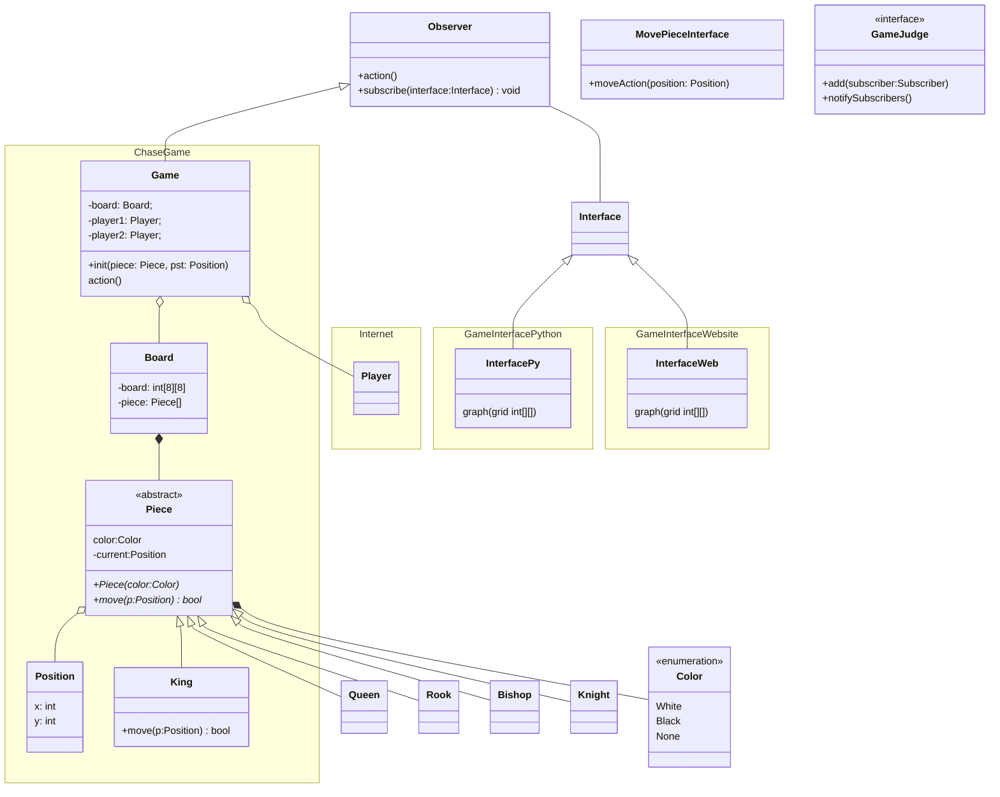

```mermaid
classDiagram
    Board *-- Piece
    Piece o-- Position
    Piece <|-- King
    Piece <|-- Queen
    Piece <|-- Rook
    Piece <|-- Bishop
    Piece <|-- Knight
    Piece *-- Color
    Game o-- Board
    Game o--Player
    Observer <|-- Game
    Interface <|-- InterfacePy
    Interface <|-- InterfaceWeb
    
    Observer -- Interface
    class Color{
        <<enumeration>>
        White
        Black
        None
    }
    namespace ChaseGame {
        class Piece {
            <<abstract>>
            color:Color
            -current:Position
            +Piece(color:Color)*
            +move(p:Position) bool*
        }
        class King{
            +move(p:Position) bool
        }

        class Position {
            x: int
            y: int
        }

        class Board {
            -board: int[8][8]
            -piece: Piece[]
        }
        class Game {
            -board: Board;
            -player1: Player;
            -player2: Player;
            +init(piece: Piece, pst: Position)
            action()
        }
    }
    class MovePieceInterface{
        +moveAction(position: Position)
    }
    class GameJudge{
        <<interface>>
        +add(subscriber:Subscriber)
        +notifySubscribers()
        
    }
    class Observer{
        +action()
        +subscribe(interface:Interface)void
    }
    namespace GameInterfacePython {
        class InterfacePy {
            graph(grid int[][])
        }
    }

    namespace Internet {
        class Player {
        }
    }
    namespace GameInterfaceWebsite {
         class InterfaceWeb {
            graph(grid int[][])
        }
    }

```